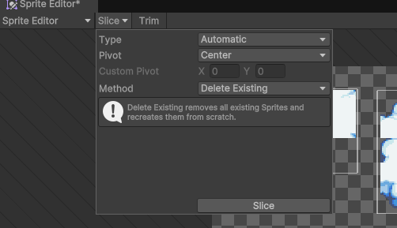
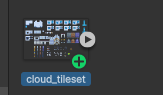

# unity安装

## 安装Unity Hub
前往[unity官网](https://unity.com/cn/download) 选择符合自己的操作系统下载对应的unity hub

一路点击安装后，打开unity hub,进行unity的安装

## 安装Unity
注册一个unity账号，然后进行unity的安装，默认会通知安装一个最新的稳定版

经过漫长的安装等待后，进行项目的创建

## 创建项目

选择通用2D，创建好相应的文件夹，给项目起一个喜欢的名字。

## 出发 unity！

大概瞄一眼unity的布局
然后出发去下载资源文件
去往[这里](https://finalbossblues.itch.io/cloud-city-tileset)下载
下载可以获得一张名为cloud_tileset.png的图片

将这张图片拖到assets中

单击图片，在右侧的Inspector中会有图片的信息，其中有一栏**Sprite Mode**我们将其改为**Multiple**这样就会把这一张大图分分割为很多小图了，Pixels Per Unit设置为16，因为每个单元的大小为16像素。 在图片质量，可以将Filter Mode设置为Point(no filter)， compression设置为None，然后点击apply进行应用。

接下来点击 **Open Sprite Editor** 打开编辑器。
单击左上角的Slice选择Grid by cell size, 像素设置为16*16，点击slice进行切分。

单击右上角的apply，退出编辑器，点击图片上的播放按钮就能看到切分好的小图了

## 创建背景
在左上角的Hierarchy中右键点击->2D Object -> TileMap -> Rectanglar，重命名一下,这里重命名为background
在正式绘制背景前，需要先调出Tile Palette, 单击菜单栏的Window->2D->Tile Palette
。
在其中创建一个新的palette