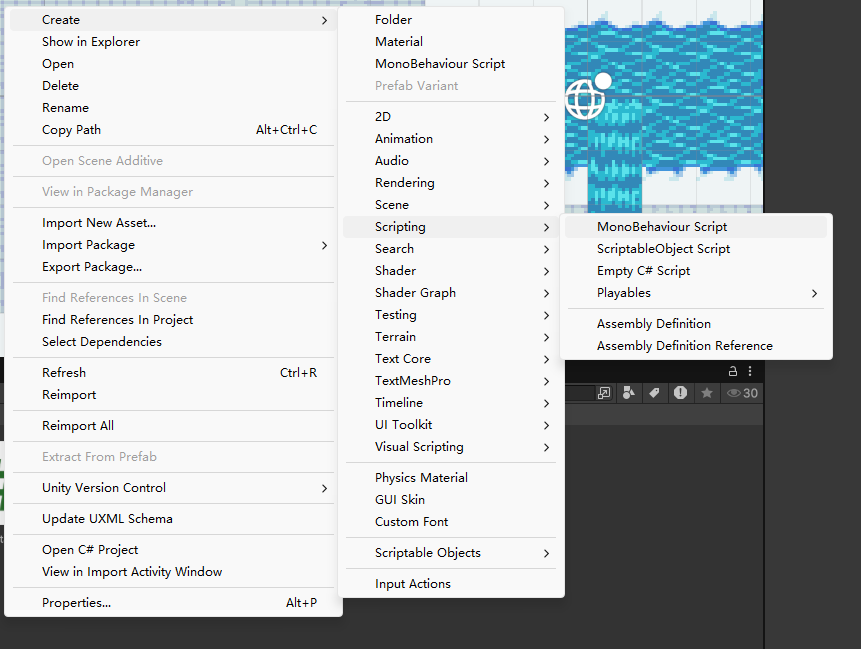

# 角色移动

## 创建角色
- 从[github](https://github.com/kiyama14/tutorial-art)中下载角色贴图
- 在Art下新建Player，然后将贴图放入，再在Inspector中进行设置
    - Sprite Mode -> Multiple
    - Pixels Per Unit -> 16
    - Filter Mode -> Point (no filter)
    - Compression -> None
- 打开 Sprite Editor进行切分
- 按16*32进行切分，并应用
- 将一个切好的角色贴图拖动到**Hierachy**中
- 如果角色不可见，右键角色调整属性(Properties)中的Order in Layer调大一点即可

## 创建移动脚本
- 在**Assets**下创建**Scripts**文件夹，于文件夹中右键创建C#脚本,注意是勾选**MonoBehaviousScript**，然后任意改一个易于理解的名字


## 配置VS关联
- 下载VS
- 在工具与扩展中勾选 **使用Unity的游戏开发**
- 在Unity中点击Edit->Prefereces-> External Tools-> External Script Editor中选择VS
- 然后双击Unity中的C#脚本就能自动跳转到VS中进行开发了

## 编写脚本
```C#
using System.Collections;
using System.Collections.Generic;
using UnityEditor.ShaderGraph.Internal;
using UnityEngine;

public class PlayerControler : MonoBehaviour
{
    public float moveSpeed;
    protected bool isMoving;
    protected Vector2 input;
    // Start is called once before the first execution of Update after the MonoBehaviour is created
    void Start()
    {
        
    }

    // Update is called once per frame
    void Update()
    {
        if (!isMoving)
        {
            input.x = Input.GetAxisRaw("Horizontal");
            input.y = Input.GetAxisRaw("Vertical");

            // what is GetAxisRaw?

            //diable diaglol movement
            if(input.x != 0)
            {
                input.y = 0;
            }

            // if the user presing any movement keys
            if (input!= Vector2.zero)
            {
                var targetPos = transform.position;
                targetPos.x += input.x;
                targetPos.y += input.y;

                StartCoroutine(Move(targetPos));
            }
        }
        
    }
    protected IEnumerator Move(Vector3 targetPos)
    {
        // when we start to move
        isMoving = true;
        
        while ((targetPos-transform.position).sqrMagnitude > Mathf.Epsilon)
        {
            transform.position = Vector3.MoveTowards(transform.position, targetPos, moveSpeed*Time.deltaTime);
            yield return null;
        }
        transform.position = targetPos;
        // moving is finished
        isMoving = false;
    }
}
```
### Input.GetAxisRaw
`Input.GetAxisRaw`函数是用以获取输入轴值,其可选参数为`"Horizontal"`和`"Vertical"`两种，用于获取unity控制的水平和垂直方向的输入值。
- 向右移动时, 值为1
- 向左移动时, 值为-1
- 向上移动时, 值为1
- 向下移动时, 值为-1
由于其值仅为0,1,-1，而不是(-1,1)之间的浮点数，所以只是用以判断是否有哪个方向的移动控制，适合做即时控制输入。

其还有个兄弟版本`Input.GetAxis`其返回值就是一个(-1,1)之间的浮点值，值会随控制键按住逐步变为-1或1, 常用于平滑过渡

### Vector2和Vector3
`Vector2`和`Vector3`就是简单的2维向量和3维向量。

`Vector2`有
- .x表示水平分量
- .y代表直分量
- .up代表(0,1)的向量 
- .down代表(0,1)
- .left代表(-1,0)
- .right代表(1,0)
- .zero代表(0,0)
- .one代表(1.1)

Vector3同理，就不再赘述

### var类型
自动推断类型，等同于C++的`auto`

### StartCoroutine
`StartCoroutine`是MonoBehaviour类的方法，用于启动协程
[官网文档](https://docs.unity.cn/cn/2019.4/ScriptReference/MonoBehaviour.StartCoroutine.html)

可以使用yield语句，随时暂停协程的执行。只用yield语句时，协程会暂停执行，并在下一帧恢复。

StartCoroutine的接口
```C#
public Coroutine StartCoroutine(IEnumerator routine);
```

### IEnumerator与yield

`IEnumerator`是一个迭代器变量, 包括
- Current->当前元素
- MoveNext()->移动到下一个元素,且有返回一个bool值来表示是否还有更多元素
- Reset(), 将迭代器重置到初始位置

示例.
```C#
int[] numbers = {1,2,3,4,5};
IEnumerator enumerator = numbers.GetEnumerator();
While(enumerator.MoveNext()){
    Console.WriteLine(enumerator.Current)
}
```

而`yield`和python中的yield相同用于返回一个迭代器，
示例
```C#
    public static IEnumerable NumberSequence()
    {
        yield return 1;
        yield return 2;
        yield return 3;
        yield return 4;
        yield return 5;
    }
```

## 绑定脚本
- 点击Player，将脚本拖至Player的Inspector中
- 配置好moveSpeed，就可以点击运行游戏进行测试了

