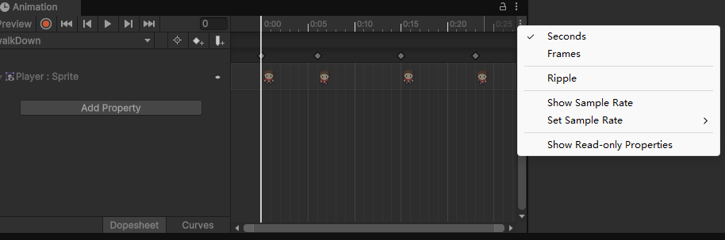
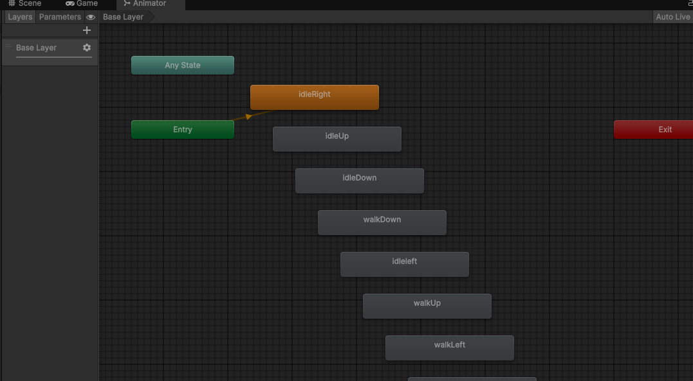
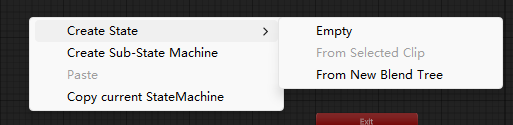
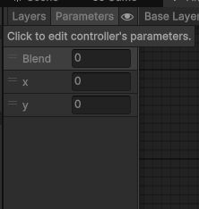
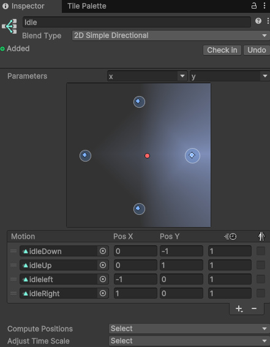
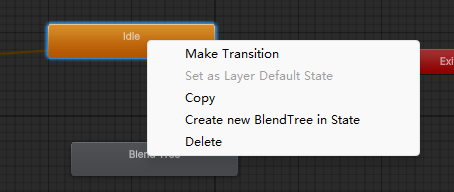

# 角色动画

## 调出动画窗口
- 点击菜单栏的Window->然后Animation->Animation将其拖动至自己喜欢的位置

## 绘制动画

- 在Assets下创建Animation文件夹
- 在Hierachy中先择Player然后在animation中选择create创建动画，存于Animation文件夹中
- 将一张或多张贴图拖动到animation的帧条中，点击播放按钮，图片就按照顺序进行播放了
- 在animation窗口点击右上角三个点，注意不是animation那行，是preview那行的三个点,然后点击show sample rate

- 将sample rate改到6

## 动画状态机

- 在animation文件夹中双击Player会得到一个包含所有动作的状态机图

- 在这里我们不直接使用当前的所有animation，我们使用方便管理的混合树.
- 删除所有我们自定义的状态，仅保留`Any State`,`Entry`,`Exit`这几个
- 右键Create State->From New Blend Tree

- 给这个blendTree状态取一个名字, Idle
- 因为Idle状态是和x,y轴输入相关的，将BlendType修改为->2D Simple Directional
- 单击animator的左上角的Parameters，再点击+号加入两个float类型参数,x和y

- 在右侧Inspector中的Parameters将参数修改为x,y
- 在下面的motion处，点击+号，新增4个motion，然后将assets/Animation下的Idel图形依次拖动到motion中,按照xy的值分配

- 可以在animator中的x,y拖动，来查看其对应的状态变化

## 代码编写

- 继续打开之前编辑好的PlayerControler.cs
- 将绑定对象的Animator拿到，并且用Awake初始化
```C#
    protected Animator animator;
    private void Awake()
    {
        animator = GetComponent<Animator>();
    }
```
- MonoBehaviour类有一些生命周期方法
    - Awake(): 对象被创建时会调用一次，初始化用
    - Start(): 第一帧调用一次, 设置游戏开始状态用
    - Update():每一帧都会调用一次,处理逻辑用
    - FixedUpdated(): 每物理帧调用一次,物理计算用
    - LateUpdate():Update()方法后调，处理帧末尾更新逻辑
    - OnEnable(): 组件被激活时调用
    - OnDisable(): 组件被禁用时调用
    - OnDestroy(): 对象被销毁时调用
- MonoBehaviour类有一系列方法响应unity的消息
    - onCollisionEnter()：当游戏对象开始与另一个游戏对象碰撞时调用
    - OnTriggerEnter():当游戏对象进入一个触发器时调用
    - OnMouseDown(): 当鼠标在游戏对象上按下时调用

- 再到input输入的地方，将x,y传入animator
```C#
        // if the user presing any movement keys
        if (input!= Vector2.zero)
        {
            animator.SetFloat("x", input.x);
            animator.SetFloat("y", input.y);

            var targetPos = transform.position;
            targetPos.x += input.x;
            targetPos.y += input.y;

            StartCoroutine(Move(targetPos));
        }
        
```
## 状态变化
- 和Idle相同，创建Walk的混合树
- 在Parameters中加上一个新的bool变量,isMoving用以标识是否在移动中，就可以应用walk
- 回到Animator的Base Layer界面, 右键Idle状态，点击Make Transition

- 将箭头拖到Walk状态
- 单击两个状态间的连线，在右边condition处新增一个条件, isMoving=true
- 将右侧的Has Exit Time框选取消
- 在settings里将Transition Duration改为0
- 同样的操作，将walk到idle的状态转换创建好
- 回到PlayerControler.cs中在其中加入对isMoving值的写入
```C#
        // if the user presing any movement keys
        if (input!= Vector2.zero)
        {
            animator.SetFloat("x", input.x);
            animator.SetFloat("y", input.y);

            var targetPos = transform.position;
            targetPos.x += input.x;
            targetPos.y += input.y;

            StartCoroutine(Move(targetPos));
        }
        animator.SetBool("isMoving", isMoving);
```
## 镜头配置
- 在Hierarchy中选择Main Camera，可以在右侧的Projection->Size改变镜头场景的大小
- 将Main Camera拖到Player上，镜头就会跟随Player移动