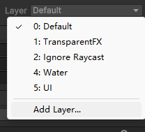
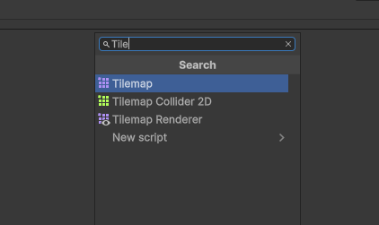

# 碰撞

## 添加新Layer
- 单击任意一个组件，例如Player，可以在右边的Inspector中发现一个Layer选项卡，默认会置于Default层
- 点击Default，选择Add Layer...

- 在Sorting Layers处添加一个前景层，在Layers中添加一个SolidObjects层
    - Sorting Layers是用以显示图层的
    - Layers是用于交互的

## 新建Tile Map
- 在Grid中新建一个Tile Map，命名为SolidObjects，将Layer定为SolidObjects, 将Sorting Layer定为ForeGround
- 在Tile Palette中绘制一个物体
- 注意，
    - 是在Scene下，而不是在Game模式下，否则绘制不了tile map
    - 注意激活的TileMap是SolidObject
- 选择SolidObject在Inspector中点击Add Component，然后输入Tile,选择Tilemap Collider 2D

- 为了提升性能，在添加一个Composite Collider 2D,它会自动创建一个刚体
    - 注意将刚体Rigidbody 2D中的Gravity Scale改为0，不然物体会由于重力往下掉
    - 或者之间将body Type从Dynamic改为static
- 由于Unity6中的Tilemap Collider 2D没有Used By Composite选项，
- 

## 更新脚本
- 打开PlayerControler.cs,添加一个新的solidObjectlayers `public LayerMask solidObjectsLayer;`
- 然后创建一个IsWalkable的函数去判断是否和solidObjectLayer重叠
```C#
    protected bool IsWalkable(Vector3 pos)
    {
        if(Physics2D.OverlapCircle(pos, Mathf.Epsilon, solidObjectsLayer) == null)
        {
            return true;
        }
        return false;
    }
```
- 在StartCoroutine前进行判断，如果能走，才走
```C#

            // check if walkable
            if (IsWalkable(targetPos))
            {
                StartCoroutine(Move(targetPos));
            }
```
- 然后退出代码编辑，在Player的Player Controler脚本参数中，将SolidObjects层拖入SolidObjetsLayer参数