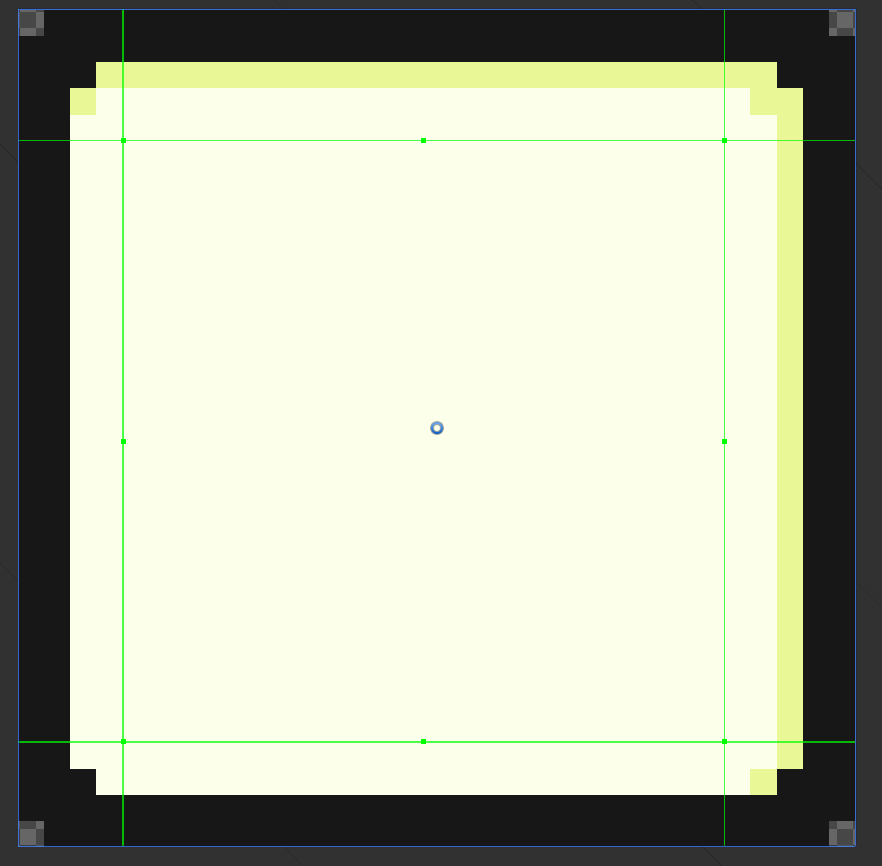
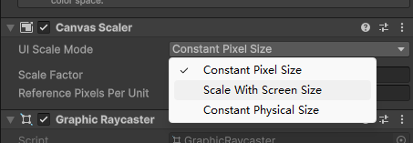
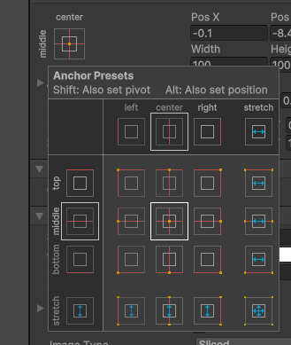
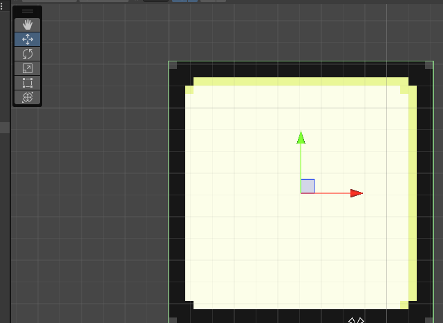
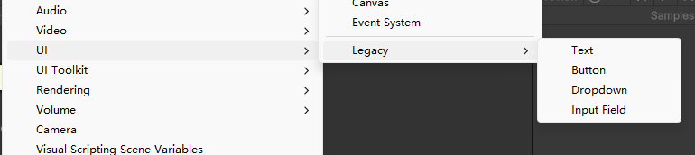
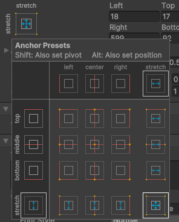
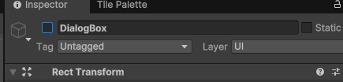
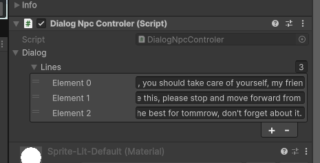

# 添加对话 part1

## Game Controler
因为在对话的时候，玩家肯定是不能移动的，所以需要一个专门的类来负责，在脚本中新建一个GameControler类，以及在Hierarchy中新建一个空的GameObject命名为GameControler
- 在Unity中`[SerializeField]`是一个Attribute，起作用是告诉unity编辑器，即使在Inspector窗口中未公开显示改字段，也该将改字段序列化
- 在GameControler中添加一个PlayerControler类型的成员变量，即使未设置成public，也可以加`[SerializeField]`让其序列号显示在Inspector中
- 然后将Player（不是PlayerContorler脚本）拖给该变量，因为Player本身绑定有PlayerControler，所以它能获取到

## 添加dialog贴图
- 将dialog贴图加入Art文件夹，在Inspector中Sprite Mode->Single,大小32，其余和以前一样调整画质。
- 在Sprite Editor中拖动线条到如下

- 在Hierarchy中右键UI->Image,创建一个Image，命名为Dialogbox
- 将刚刚切的dialog-box贴图拖至右侧Inspector中->Image->Sourcde Image
- 点击Canvas在右侧Inspector中CanVas Scaler->UI Scale Moode设置为Scale With Screen Size

- 在Scene视窗下，选择DialogBox，在右侧的Inspector中的Rect Transform有一个位置选择，按住Alt可以有更多靠边的选择

- 在Scene中左上角的移动图标可以移动图片，方框图标可以拖动扩展图片

- 右键DialogBox，在UI->Legacy选择text创建文本，命名为DialogText

- 在DialogText的Inspector中对其方式选择四面对齐

- 将新字体拖动进DialogText的Inspector->Tet->Character->Font处
## Dialog相关脚本编写

## 测试
- 编写完后，先在左侧Hierarchy中选择DialogBox，在右侧的Inspector取消对其的勾选将其取消激活
,因为待会儿在脚本中会去激活它
- 将DialogManager脚本添加给GameControler，再将DialogBox和DialogText参数放进去，配置好文字显示速度
- 在dialogNpc的DialogNpcController脚本配置处写一些文本
